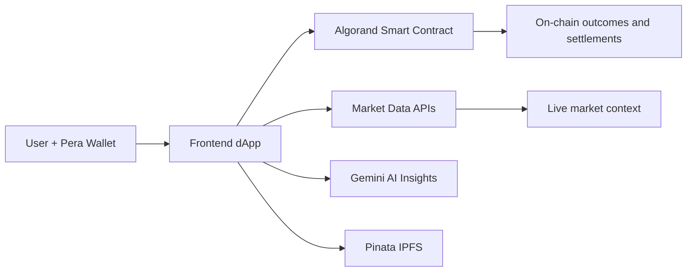
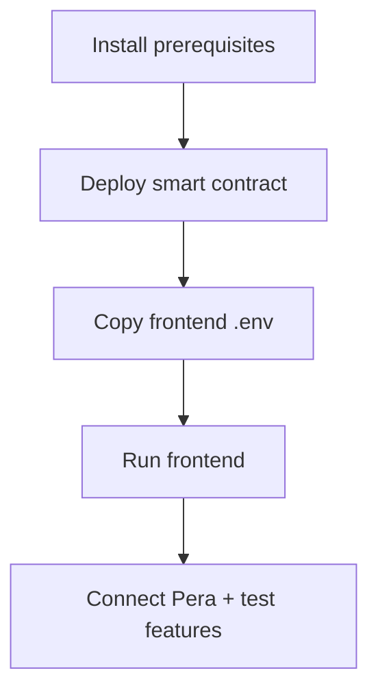
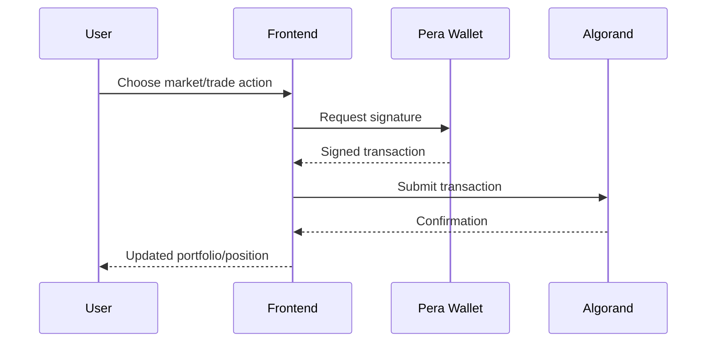

# PredX — Decentralized Prediction & Trading Platform

PredX is a DeFi platform on **Algorand TestNet** that combines:
- binary prediction markets,
- simulated stock + crypto trading,
- AI-assisted market analysis,
- NFT minting workflows.

## 🧠 What the project does (at a glance)



## 🚀 Core Capabilities

- **Prediction Markets**: Place YES/NO bets backed by ARC-4 smart contracts and oracle scripts.
- **Trading Terminal**: Simulated trading for NSE/BSE stocks and crypto pairs.
- **AI Analyzer**: Gemini-powered sentiment and portfolio guidance.
- **NFT Minting (ARC-3)**: Media + metadata flow via Pinata/IPFS with Algorand recording.
- **Wallet Integration**: Pera wallet transaction signing for TestNet interactions.

## 🗺️ Repository Map

- `/frontend` — React 18 + Vite app (UI, wallet integration, trading/prediction experience)
- `/smart-contracts` — contract logic, deployment, and market resolution scripts
- `/backend` — backend services and supporting integrations

## ⚡ Quick Setup (recommended path)



### 1) Prerequisites

- **Node.js** (v20+) and `npm`
- **Python** (v3.10+) and `pip`
- **Pera Wallet** with TestNet ALGO from faucet: https://bank.testnet.algorand.network/
- (Optional) **Pinata JWT** for NFT flow
- (Optional) **Gemini API key** for AI features

### 2) Deploy smart contract

```bash
cd smart-contracts
pip install -r requirements.txt
cp .env.template .env
python deploy.py
```

Save the generated **Application ID**.

### 3) Configure and run frontend

```bash
cd frontend
npm install
cp .env.template .env
npm run dev
```

Open: `http://localhost:5173`

## 🔍 Typical User Flow



## 🧱 Tech Stack

- **Frontend**: React, Vite, Tailwind
- **Blockchain**: Algorand SDK + ARC standards
- **AI**: Google Gemini
- **Storage**: Pinata/IPFS
- **Data Sources**: market APIs for stocks and crypto

## 📄 Notes

Built for hackathon/evaluation use on TestNet. Tokens and values are for demonstration.
